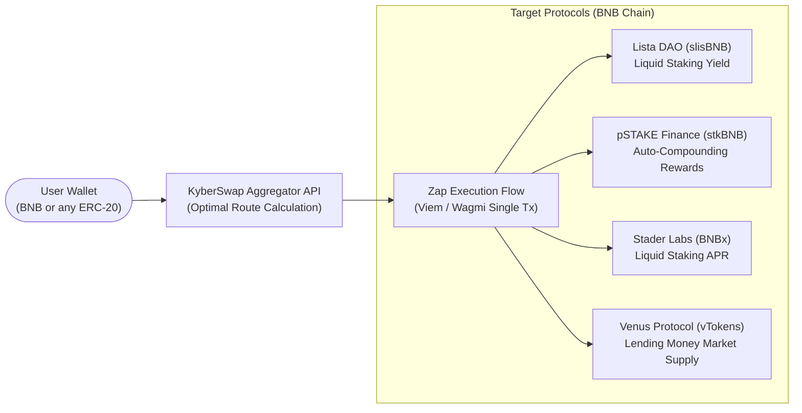

# Arbitrage Inception — Earn & Vaults

A multi-protocol yield aggregator and vault manager on BNB Smart Chain, designed to streamline entry into top DeFi yield strategies.

**Live Application:** [https://arbitrage-inc-earn.vercel.app](https://arbitrage-inc-earn.vercel.app)  
**Main Platform:** [https://arbitrage-inc.exchange](https://arbitrage-inc.exchange)  
**License:** [MIT](./LICENSE)

---

## Architecture & Yield Topology



---

## Overview

Arbitrage Inception Vaults aggregates prominent yield-bearing protocols on BNB Chain into a single non-custodial interface. Through direct integration with the **KyberSwap Aggregation API**, users can deposit into liquid staking and lending positions using native BNB or any supported token with automated route calculation and single-transaction execution.

### Key Capabilities:
- **DeFi "Zap" Composition:** Single-action swap and deposit. Converts any input token to the required vault underlying asset before executing contract calls.
- **Lending Markets Interaction:** Direct supply and mint calls to **Venus Protocol** money market contracts (`vTokenAbi`, `vUSDT`, `vUSDC`).
- **Liquid Staking Integration:** Seamless staking flows for **Lista DAO**, **pSTAKE Finance**, and **Stader Labs**.
- **Modern EVM Tooling:** Built using **Viem** and **Wagmi v2** for type-safe contract calls, fast RPC state reconciliation, and minimal bundle footprint.

---

## Supported Protocols & Vaults

- **Liquid Staking:**
  - **Lista DAO** (`slisBNB`): Liquid staked BNB earning protocol staking yields.
  - **pSTAKE Finance** (`stkBNB`): Auto-compounding BNB staking rewards.
  - **Stader Labs** (`BNBx`): Liquid staking with automated compound rewards.
- **Lending Markets:**
  - **Venus Protocol** (`vUSDT`, `vUSDC`): Decentralized money market supply with automated swap and deposit logic.

---

## Tech Stack

- **Framework:** Next.js 15 (App Router), React 19
- **Web3 Layer:** Wagmi 2, Viem 2, React Query 5 (type-safe RPC state management)
- **Routing & Execution:** KyberSwap Aggregator API v1 (quote fetching, route building, fee collection)
- **Styling & UI:** Tailwind CSS, Lucide Icons, Framer Motion
- **Deployment:** Vercel Edge / Serverless

---

## Local Development

1. **Clone the repository:**
   ```bash
   git clone https://github.com/Lukecele/arbitrage-inc-earn.git
   cd arbitrage-inc-earn
   ```

2. **Install dependencies:**
   ```bash
   npm install
   ```

3. **Run the development server:**
   ```bash
   npm run dev
   ```

Open [http://localhost:3000](http://localhost:3000) with your browser to see the application.

---

## License

Released under the [MIT License](./LICENSE).
